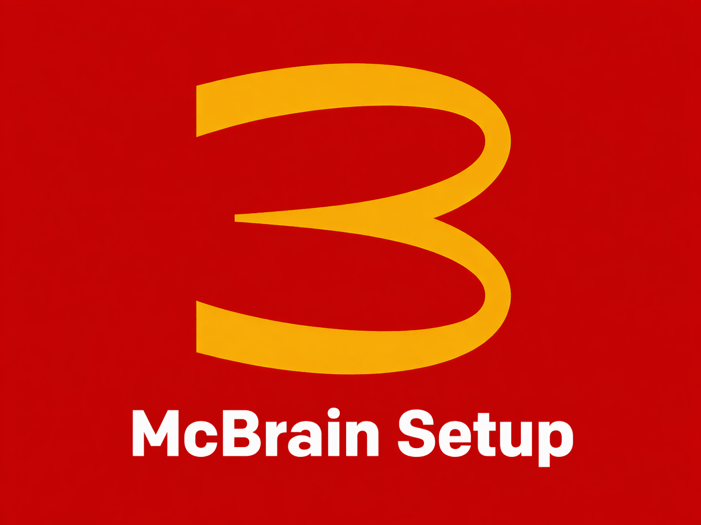

# McBrain Setup

Claude Skill for bootstrapping a McBrain vault — a persistent, Obsidian-based personal knowledge base operated by Claude Cowork (Claude Desktop).

Based on Andrej Karpathy's [LLM Wiki](https://x.com/karpathy/status/2039805659525644595) pattern: instead of re-deriving knowledge from raw sources every session, Claude builds and maintains a persistent markdown wiki that compounds over time. Obsidian is the IDE; Claude is the programmer; McBrain is the codebase.

This is the **one-shot setup skill**. Run it once per vault. After that, the companion [`mcbrain`](../mcbrain) skill handles day-to-day operations.

McBrain was designed for **Claude Cowork** (Claude Desktop), but also works from **Claude Code** in the terminal — the filesystem MCP and both skills behave the same way in either host.

## Requirements

Before running this skill, you need:

- **A Claude account** — required to use Claude Cowork (Claude Desktop) or Claude Code
- **Claude Cowork (Claude Desktop)** installed — the primary target host. Download at [claude.ai/download](https://claude.ai/download). Claude Code works as an alternative.
- **Obsidian** installed — the viewer/editor for the vault. Download at [obsidian.md](https://obsidian.md)
- **Node.js** — required by the filesystem MCP server (`npx` runs it). Install from [nodejs.org](https://nodejs.org) if `node --version` fails.

Optional, depending on backup choice:

- **GitHub account + `gh` CLI** — only if you pick the Git backup strategy
- **Google Drive for Desktop** — only if you pick the Google Drive backup strategy

## What this skill does

End-to-end bootstrap for a new vault:

- **Name and locate** — picks the vault name (`mcbrain-<topic>`) and filesystem path
- **Backup strategy** — Git + GitHub (with remote repo created up front), Google Drive, or none
- **Scaffold** — creates `raw/`, `wiki/`, and the starter files (`index.md`, `log.md`, `overview.md`, `CLAUDE.md`)
- **CLAUDE.md** — writes the vault's source-of-truth config, including the Web Ingestion Routing and Backup sections
- **MCP config** — merges the filesystem MCP block into `claude_desktop_config.json`
- **Obsidian + extensions** — walks through Obsidian vault setup, Claude in Chrome, and Obsidian Web Clipper
- **Verify** — confirms Claude can read `CLAUDE.md` through the new MCP

Claude executes the steps it can (directories, files, `git`, `gh repo create`, config merges) and only defers to the user for GUI-only actions, OAuth flows, and decisions like the vault name.

## How it fits with `mcbrain`

Two-skill split:

1. **`mcbrain-setup`** (this skill) — runs once. Creates the vault, wires up the MCP, configures backup.
2. **[`mcbrain`](../mcbrain)** — runs every session. Handles ingest, query, lint, and synthesis against the vault the setup skill created.

The vault's `CLAUDE.md` is what ties them together: setup writes it; the operating skill reads it at the start of every operation.

## Backup strategies

Picked during setup and recorded under `## Backup` in `CLAUDE.md`:

- **`git`** — private GitHub repo created via `gh` before any files exist, so the vault is linked to its remote from the first commit. Full version history; easy rollback of bad edits.
- **`google-drive`** — Drive for Desktop watches the vault folder and syncs continuously. Simplest option, no terminal needed.
- **`none`** — local only. Confirmed twice before proceeding.

## Multiple vaults

Each vault gets its own MCP server named `mcbrain-<topic>` (e.g., `mcbrain-ai-science`, `mcbrain-finance`). Run this setup skill once per vault. The operating skill routes by name, so a user can maintain several vaults side by side without collision.

## Raw-sources-first rule

Setup bakes this into `CLAUDE.md`: every wiki page must be backed by a file in `raw/`. The operating skill enforces it — no synthesizing pages from web search results alone. This is the immutable rule of the system and is set here at bootstrap.

## Reference files

Templates used during scaffolding live in `references/`:

- `claude-md-template.md` — the CLAUDE.md schema
- `index-template.md` — starter `wiki/index.md`
- `log-template.md` — starter `wiki/log.md`
- `overview-template.md` — starter `wiki/overview.md`
