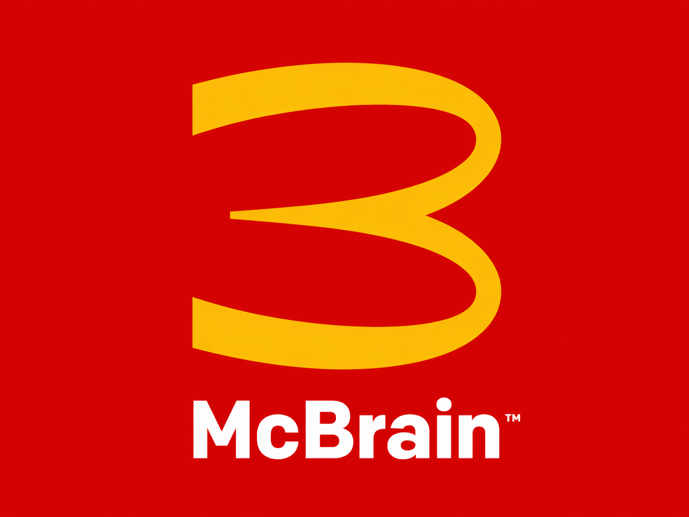

# McBrain

Claude Skill for operating an Obsidian-based personal knowledge base from Claude Cowork (Claude Desktop).

Based on Andrej Karpathy's [LLM Wiki](https://x.com/karpathy/status/2039805659525644595) pattern: instead of re-deriving knowledge from raw sources every session, Claude builds and maintains a persistent markdown wiki that compounds over time. Obsidian is the IDE; Claude is the programmer; McBrain is the codebase.

McBrain is designed to be easy to install and use from within **Claude Cowork** (Claude Desktop), but it also works from **Claude Code** in the terminal — the filesystem MCP and the skill work the same way in either host.

## What this skill does

This is the **operating skill** — it runs day-to-day against an already-configured vault. It handles:

- **Ingest** — read a source (article, PDF, note) and write compiled wiki pages with `[[wikilinks]]`
- **Query** — answer questions against the vault, citing the pages used
- **Lint** — find contradictions, orphan pages, stale claims, and missing cross-references
- **Synthesis** — file a new wiki page that merges insights across existing pages

On every operation it updates `wiki/index.md` and appends to `wiki/log.md`, and — when the vault is backed by git — offers to commit and push.

## How it works

McBrain uses a two-layer design:

1. **This skill** catches the user's intent ("ingest this", "ask my brain", "lint McBrain") and routes to the right vault's MCP filesystem server.
2. **The vault's `CLAUDE.md`** is the source of truth for directory layout, page conventions, backup strategy, and the canonical procedures for ingest/query/lint.

The skill reads `CLAUDE.md` at the start of every operation, so the vault's conventions travel with the knowledge base and can evolve independently of the skill.

## Multiple vaults

A user can maintain several McBrain vaults (e.g., `mcbrain-ai-science`, `mcbrain-finance`, `mcbrain-clinical-guidelines`). Each has its own filesystem MCP server, and the skill routes by name:

> "Find insights from McBrain AI Science about sparse attention" → `mcbrain-ai-science` MCP

If the user says "McBrain" with no qualifier and more than one vault is connected, the skill asks which one.

## Setup

Setup is a one-time bootstrap handled by the companion skill [`mcbrain-setup`](../mcbrain-setup). That skill:

- Names and locates the vault
- Creates the directory scaffold (`raw/`, `wiki/`, `CLAUDE.md`)
- Configures the backup strategy (Git + GitHub, Google Drive, or none)
- Writes the filesystem MCP block into `claude_desktop_config.json`
- Walks through Obsidian and browser extension setup

Run `mcbrain-setup` once per vault. After that, this operating skill handles everything else.

## Typical commands

```
Ingest raw/articles/<file>.md into McBrain. Update index and log.
Ask McBrain: <question>. Cite the pages you used.
Lint McBrain. Find contradictions, orphan pages, stale claims.
File your answer as a new wiki page at wiki/<topic>.md.
```

## Raw-sources-first rule

Wiki pages must be backed by a file in `raw/`. The skill will refuse to synthesize pages from web search results alone — every claim needs a traceable source in the vault. This is enforced by `CLAUDE.md` and is the immutable rule of the system.

## Backup

The skill respects whatever backup strategy was chosen at setup time, recorded in `CLAUDE.md` under `## Backup`:

- **`git`** — offers to commit and push after meaningful operations
- **`google-drive`** — no git operations; Drive for Desktop syncs automatically
- **`none`** — writes files only, no backup steps
